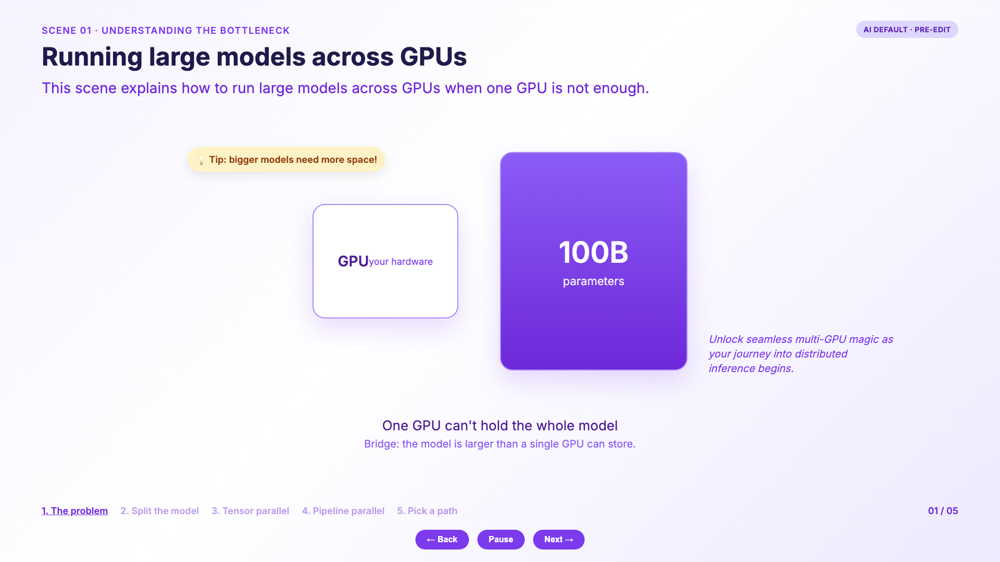
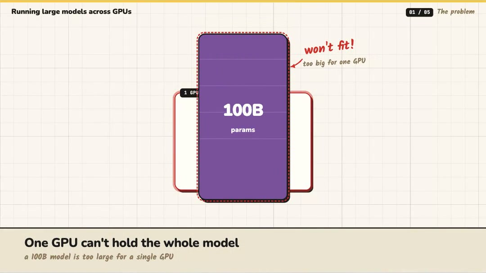
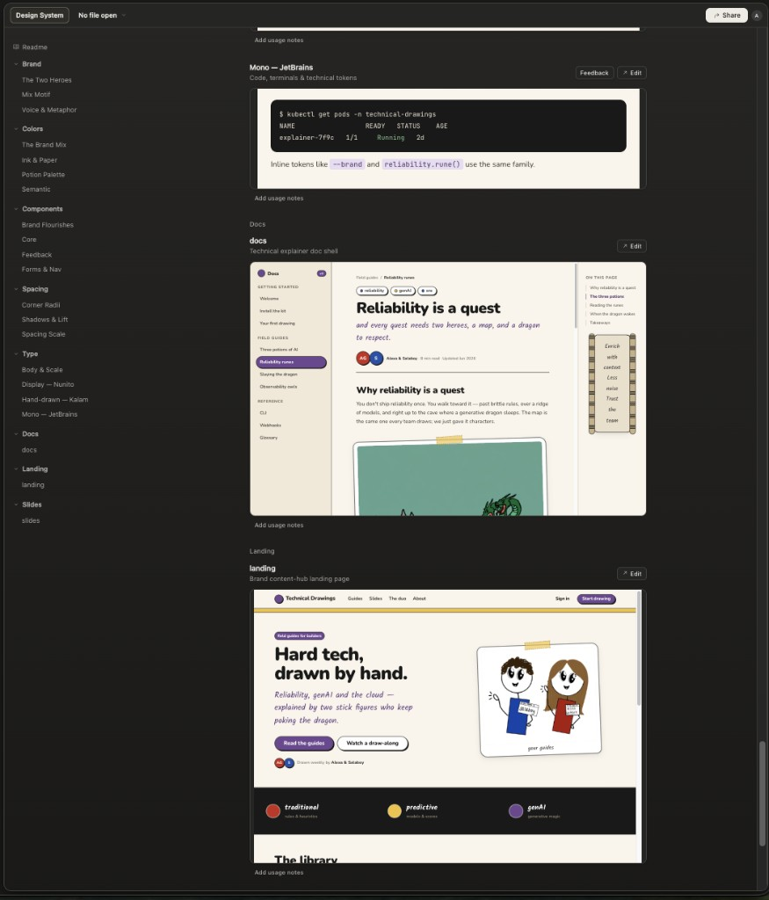
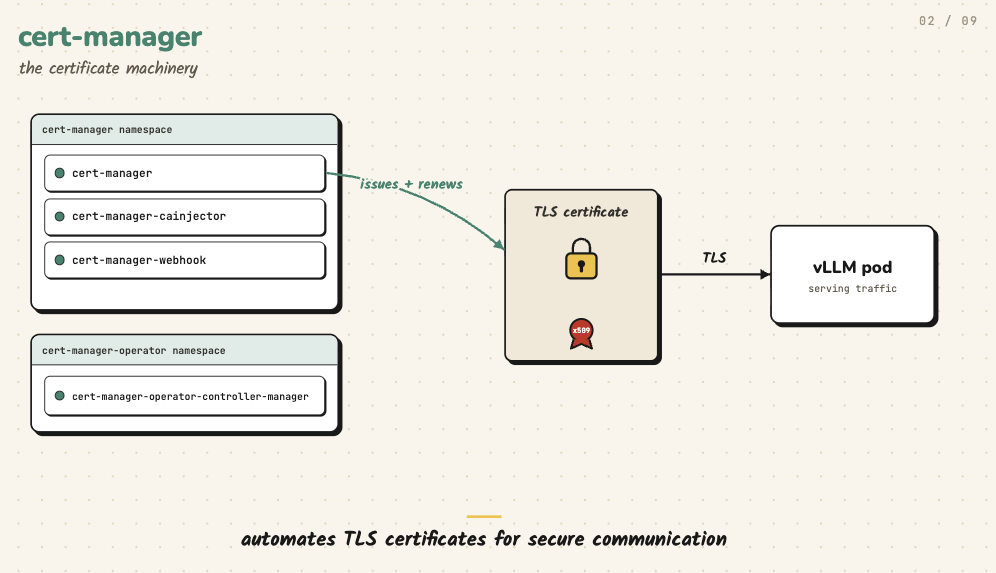
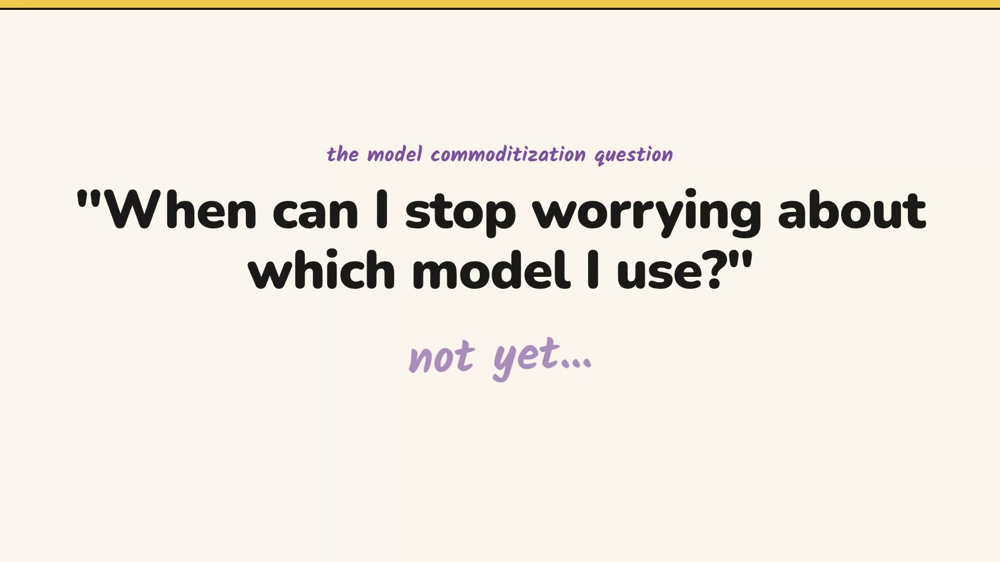
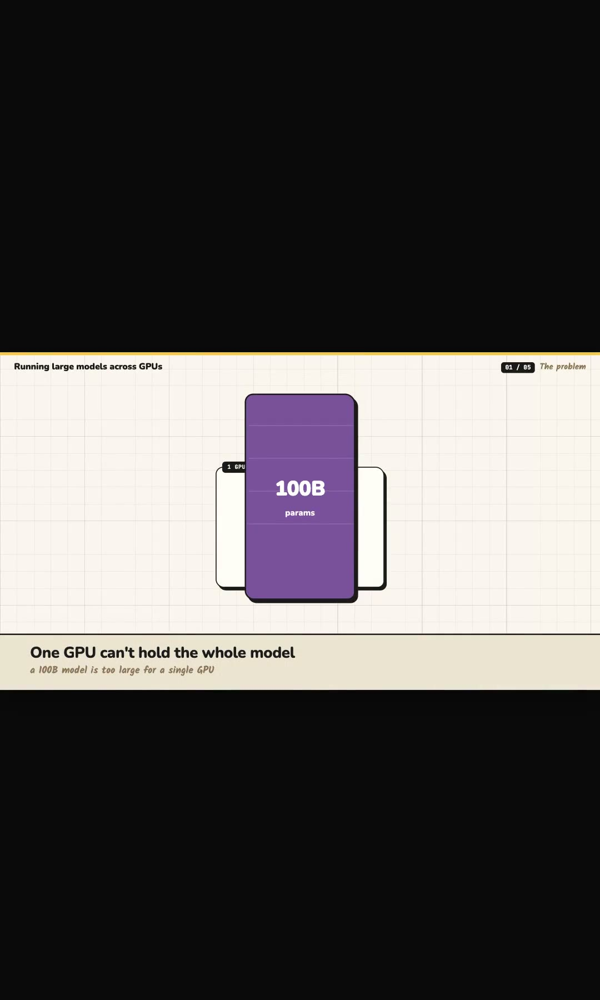
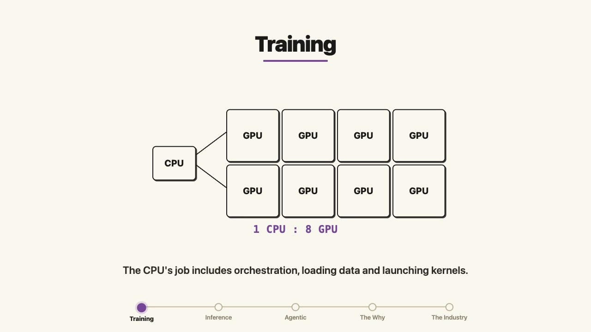

# Agent Skills

Skills for Claude Code and other agents that follow the
[Agent Skills](https://agentskills.io/) layout: one folder per skill, with a
`SKILL.md` router and optional `references/` loaded on demand.

## Skills

| Skill | What it does |
|-------|----------------|
| [`explainer-animation`](./skills/explainer-animation/) | Structure-only prompts for Claude Design explainer animations. Content spine first, then layout / pacing / text — never colors or fonts. Your design system owns style. See [`references/principles.md`](./skills/explainer-animation/references/principles.md). |
| [`visual-style-laws`](./skills/visual-style-laws/) | Rules for headings, prose, tables, and theming on visual pages and decks. |

## How it works (`explainer-animation`)

1. Have an idea.
2. Invoke the skill to turn it into a Claude Design prompt.
3. Paste into Claude Design with your design system already loaded.
4. Iterate on the live render — often under five passes, not a guarantee.

## Install

```bash
# one skill (references required; examples optional)
cp -R skills/explainer-animation ~/.claude/skills/

# or into a project
cp -R skills/explainer-animation .claude/skills/
```

Keep `references/` next to `SKILL.md`.

Or with [skills.sh](https://skills.sh):

```bash
npx skills add alexagriffith/agent-skills
```

## Before vs shipped

Same beat (“one GPU can’t hold a 100B model”).

**Before** — style and filler baked into the prompt (purple gradient, restating
subtitle, tip pill, invented marketing line, labeled step tracker, Back / Pause / Next):



**Shipped** — structure-only prompt + design tokens already in the project:



Video: [`02-gpu-parallelism.mp4`](./skills/explainer-animation/examples/02-gpu-parallelism.mp4)

## Design system (example)

The skill never names colors, fonts, or a palette. Style comes from whatever is
already loaded in the Claude Design project:



## Shipped examples

Made with a loaded design system + structure prompts. Source files in
[`skills/explainer-animation/examples/`](./skills/explainer-animation/examples/).

**Good example — ownership + path:** cert-manager issues and renews a TLS certificate;
the vLLM pod serves traffic over TLS.



### Model commodity question



### Running large models across GPUs



### CPU:GPU ratio



### Files

| Piece | Preview | Video |
|-------|---------|-------|
| Model commodity question | [poster](./skills/explainer-animation/examples/01-model-commodity-question.jpg) | [mp4](./skills/explainer-animation/examples/01-model-commodity-question.mp4) |
| Running large models across GPUs | [poster](./skills/explainer-animation/examples/02-gpu-parallelism.jpg) | [mp4](./skills/explainer-animation/examples/02-gpu-parallelism.mp4) |
| cert-manager | [poster](./skills/explainer-animation/examples/03-cert-manager.png) | — |
| CPU:GPU ratio | [poster](./skills/explainer-animation/examples/04-cpu-gpu-ratio.jpg) | [mp4](./skills/explainer-animation/examples/04-cpu-gpu-ratio.mp4) |

## Writing cleanup (short list)

Handy when on-screen copy still feels soft:

- **Clear, not simplified.** Keep the precise term. Explain it.
- **Positive first, then the boundary.**
- **Subject first, number second.**
- **No restating headers.** If the diagram carries it, omit the line.

## Add another skill

1. Create `skills/<skill-name>/SKILL.md` (YAML frontmatter: `name`, `description`).
2. Put deep rules in `skills/<skill-name>/references/` — keep the router short.
3. Optional demos go in `skills/<skill-name>/examples/`.
4. Do **not** put a README inside the skill folder (repo README covers install).
5. List it in the table above.
6. Push.

## License

MIT. See [LICENSE](./LICENSE).
