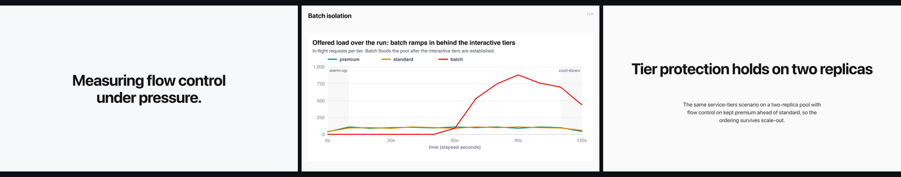
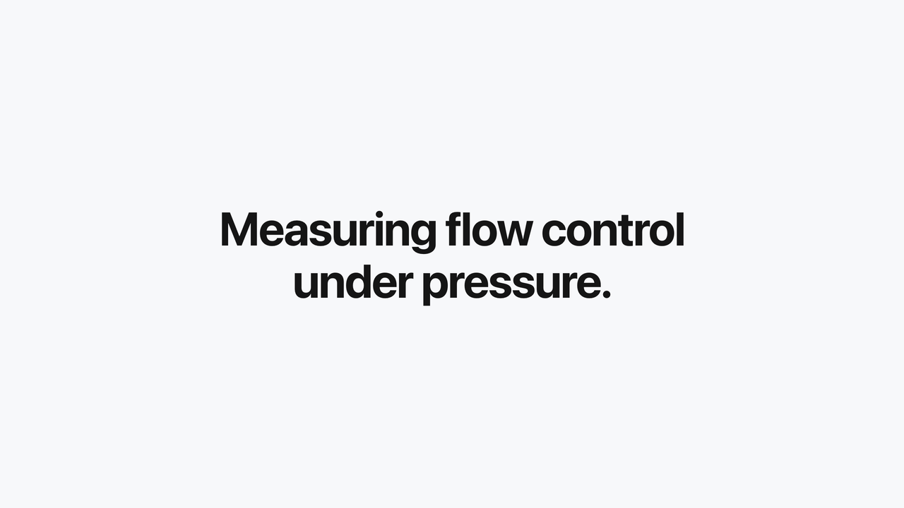
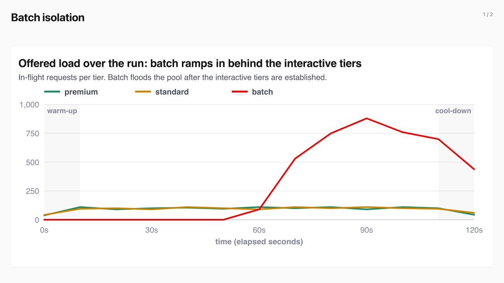
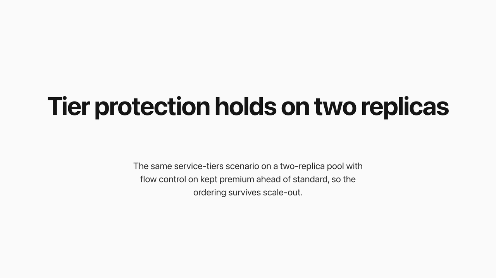
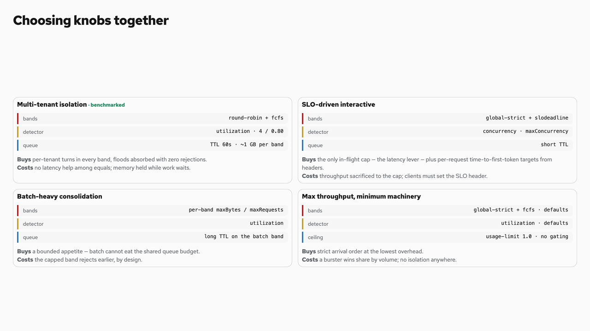
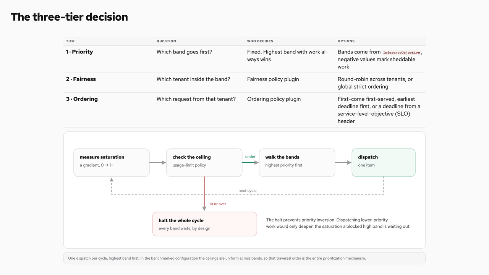

# html2deck

Turn a long HTML page into **16:9 PowerPoint and PDF slides**.

The skill measures what Chromium actually renders, projects a visual-first face
(excess prose → speaker notes), and splits at safe block boundaries. It never
crushes text to fit, and it never paints past the content box width.

---

## What you get

One HTML page → many slides → a contact sheet to review → `.pptx` + `.pdf`.



| Input | Output |
|-------|--------|
| Benchmark walkthrough / written explainer / long HTML | `slides/*.png`, contact sheet, `deck.pptx`, `deck.pdf` |

---

## Slide shapes

### Title / section header

Text only. Centered on the canvas. Never a chart, table, or card.



### Chart under a fixed title bar

Heading stays pinned (PowerPoint-master style). The figure fills the content
zone and cannot overflow the sides.



### Text-only remnant

If a unit has no image and only a short line of prose, it is centered like a
title page — not a lonely paragraph under a top-left title.



### Card grids stay on the face

Posture / knob cards (`grid2`, chips) are treated as visuals, not captions.



### Wide tables

Tables use a fixed layout and a hard width clamp so columns are not clipped.



---

## Quick start

```bash
./scripts/bootstrap.sh   # playwright + chromium + deps

python3 slice.py path/to/page.html --unit-selector section --theme light
python3 contact_sheet.py _out
python3 build.py _out --pptx --pdf --name my-deck
```

Open `_out/contact-sheet.html`, approve, then ship the pptx/pdf.

### Options

- `--theme light|dark` — stamps `data-theme` on the page before render
- `--keep-source` — skip face projection (debug)
- `--unit-selector CSS` — default `section`

---

## Layout contract (short)

1. **Measure**, then fit or split — never shrink below the readability floor.
2. **Fixed title bar** on content slides; title page / section headers are
   centered text-only.
3. **Visuals own the face**; long prose moves to speaker notes.
4. **Width is hard** — painted content never exceeds the content box.
5. Full rules live in [`SKILL.md`](./SKILL.md).

---

## Install

```bash
cp -R skills/html2deck ~/.claude/skills/
# or
npx skills add alexagriffith/agent-skills
```

---

## Tests

```bash
python -m pytest tests/
```

Uses a bundled fixture under `tests/fixtures/` (no machine-local paths).

---

## Examples

| File | What it shows |
|------|----------------|
| [`examples/01-title-slide.png`](./examples/01-title-slide.png) | Centered title page |
| [`examples/02-chart-slide.png`](./examples/02-chart-slide.png) | Chart under master title |
| [`examples/03-text-only-centered.png`](./examples/03-text-only-centered.png) | Short text, centered |
| [`examples/04-card-grid.png`](./examples/04-card-grid.png) | Card grid retained |
| [`examples/05-table-and-diagram.png`](./examples/05-table-and-diagram.png) | Table + diagram, width-safe |
| [`examples/06-pipeline-strip.png`](./examples/06-pipeline-strip.png) | Three shapes at a glance |

Slides above are from the public
[flow-control-benchmarks](https://alexagriffith.github.io/flow-control-benchmarks/)
walkthrough and written explainer exports.
